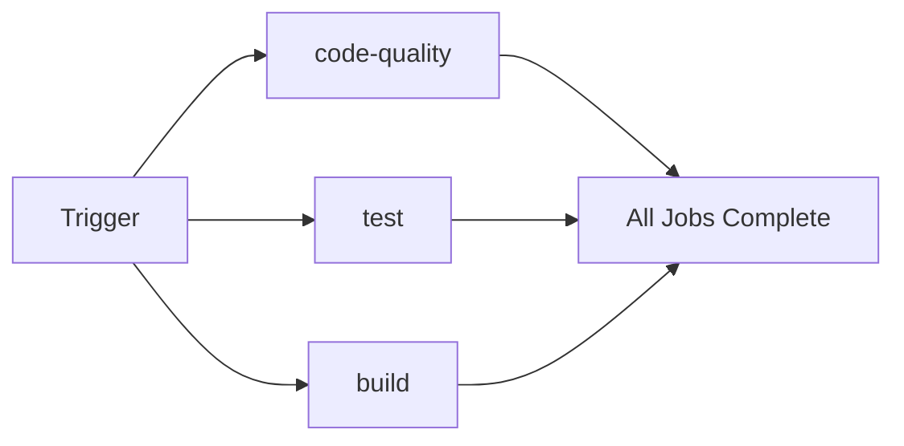

# Task 10: CI/CDの統合 - テスト自動実行と手動トリガー

## 目的
Task 8（Biome CI）とTask 9（Vitest）を統合し、GitHub Actionsで包括的なCI/CDパイプラインを構築する

## 所要時間
約30-40分

## 前提条件
- Task 8が完了していること（Biome CI設定済み）
- Task 9が完了していること（Vitestテスト作成済み）
- GitHubリポジトリにプッシュ済み
- GitHub Actionsの基本を理解していること

## このタスクで学ぶこと
- GitHub Actionsでの複数ジョブの並列実行
- テストカバレッジの可視化
- ワークフローの手動実行（workflow_dispatch）
- CIバッジの追加
- テスト結果のレポート生成

## 🎯 ミッション

**GitHub ActionsのCIワークフローに単体テストを追加し、コード品質とテストを自動チェック！さらに手動実行も可能にしてください！**

## 📚 前提知識

### GitHub Actionsのジョブとは？

ワークフロー内で並列または直列に実行されるタスクのセットです。

```yaml
jobs:
  job1:  # 並列実行
    runs-on: ubuntu-latest
    steps: [...]

  job2:  # 並列実行
    runs-on: ubuntu-latest
    steps: [...]

  job3:  # job1の後に実行
    needs: job1
    runs-on: ubuntu-latest
    steps: [...]
```

### workflow_dispatchとは？

GitHub UIから手動でワークフローを実行できる機能です。

```yaml
on:
  workflow_dispatch:  # 手動実行を有効化
    inputs:
      test-type:
        description: 'テストの種類'
        required: true
        default: 'all'
```

## 🚀 実装の進め方

### ステップ1: 既存のCIワークフローを確認する（5分）

#### 1-1. 現在のワークフローを確認

Task 8で作成した`.github/workflows/ci.yml`を確認：

```
example1プロジェクトの .github/workflows/ci.yml の内容を表示してください。
```

現在は`code-quality`ジョブのみが定義されているはずです。

#### 1-2. 現在の構成を理解する

Claude Codeに質問：

```
現在のGitHub Actionsワークフローについて説明してください：
1. どのイベントで実行される？
2. どのジョブが定義されている？
3. 何をチェックしている？
```

### ステップ2: テストジョブを追加する（10分）

#### 2-1. ワークフローを拡張

Claude Codeに依頼：

```
.github/workflows/ci.yml を以下のように拡張してください：

1. 既存のcode-qualityジョブはそのまま維持
2. 新しく test ジョブを追加
   - Node.js 20を使用
   - 依存関係をインストール
   - Vitestでテストを実行
   - テストカバレッジを生成
3. code-qualityとtestは並列実行
4. workflow_dispatchを追加して手動実行を可能にする
```

#### 2-2. 期待されるワークフロー

`.github/workflows/ci.yml`:

```yaml
name: CI

on:
  pull_request:
    branches: [main]
  push:
    branches: [main]
  workflow_dispatch:  # 手動実行を有効化

jobs:
  code-quality:
    name: Code Quality Check
    runs-on: ubuntu-latest

    steps:
      - name: Checkout code
        uses: actions/checkout@v4

      - name: Setup Node.js
        uses: actions/setup-node@v4
        with:
          node-version: '20'
          cache: 'npm'
          cache-dependency-path: example1/package-lock.json

      - name: Install dependencies
        working-directory: example1
        run: npm ci

      - name: Run Biome format check
        working-directory: example1
        run: npx @biomejs/biome format ./src

      - name: Run Biome lint
        working-directory: example1
        run: npx @biomejs/biome lint ./src

      - name: Run Biome check
        working-directory: example1
        run: npx @biomejs/biome check ./src

  test:
    name: Unit Tests
    runs-on: ubuntu-latest

    steps:
      - name: Checkout code
        uses: actions/checkout@v4

      - name: Setup Node.js
        uses: actions/setup-node@v4
        with:
          node-version: '20'
          cache: 'npm'
          cache-dependency-path: example1/package-lock.json

      - name: Install dependencies
        working-directory: example1
        run: npm ci

      - name: Run tests
        working-directory: example1
        run: npm run test

      - name: Generate coverage report
        working-directory: example1
        run: npm run test:coverage

      - name: Upload coverage reports to Codecov
        uses: codecov/codecov-action@v4
        with:
          directory: ./example1/coverage
          files: ./example1/coverage/coverage-final.json
          flags: unittests
          name: codecov-umbrella
          fail_ci_if_error: false
        env:
          CODECOV_TOKEN: ${{ secrets.CODECOV_TOKEN }}
```

#### 2-3. ワークフローの変更点を理解する

Claude Codeに質問：

```
更新したワークフローについて説明してください：

1. workflow_dispatch とは何か？どう使うのか？
2. code-quality と test ジョブは並列実行される？
3. codecov/codecov-action@v4 は何をするのか？
4. fail_ci_if_error: false の意味は？
```

### ステップ3: ビルドジョブを追加する（5分）

#### 3-1. ビルドチェックを追加

Claude Codeに依頼：

```
.github/workflows/ci.yml に build ジョブを追加してください。

要件：
1. Next.jsのビルドが成功することを確認
2. code-quality、test と並列実行
3. ビルド成果物をアーティファクトとしてアップロード（オプション）
```

#### 3-2. 期待されるビルドジョブ

```yaml
  build:
    name: Build Check
    runs-on: ubuntu-latest

    steps:
      - name: Checkout code
        uses: actions/checkout@v4

      - name: Setup Node.js
        uses: actions/setup-node@v4
        with:
          node-version: '20'
          cache: 'npm'
          cache-dependency-path: example1/package-lock.json

      - name: Install dependencies
        working-directory: example1
        run: npm ci

      - name: Build application
        working-directory: example1
        run: npm run build

      - name: Upload build artifacts
        uses: actions/upload-artifact@v4
        with:
          name: nextjs-build
          path: example1/.next
          retention-days: 7
```

### ステップ4: ワークフローを手動実行する（5分）

#### 4-1. GitHubでワークフローを手動実行

1. GitHubリポジトリのページを開く
2. `Actions` タブをクリック
3. 左サイドバーから `CI` ワークフローを選択
4. `Run workflow` ボタンをクリック
5. ブランチを選択して実行

#### 4-2. GitHub CLIで手動実行

Claude Codeに依頼：

```
GitHub CLIを使って、CIワークフローを手動実行してください。
```

期待されるコマンド：

```bash
# ワークフロー一覧を表示
gh workflow list

# CIワークフローを手動実行
gh workflow run ci.yml

# 実行状況を確認
gh run list --workflow=ci.yml
```

### ステップ5: 入力パラメータ付き手動実行（10分）

#### 5-1. 入力パラメータを追加

Claude Codeに依頼：

```
workflow_dispatch に入力パラメータを追加してください。

パラメータ：
1. test-scope: テストのスコープ（all, unit, integration）
2. skip-build: ビルドをスキップするか（true/false）
3. environment: 環境（development, staging, production）

これらのパラメータを使ってジョブの実行を制御してください。
```

#### 5-2. 期待される設定

```yaml
on:
  pull_request:
    branches: [main]
  push:
    branches: [main]
  workflow_dispatch:
    inputs:
      test-scope:
        description: 'テストのスコープ'
        required: true
        default: 'all'
        type: choice
        options:
          - all
          - unit
          - integration
      skip-build:
        description: 'ビルドをスキップ'
        required: false
        default: false
        type: boolean
      environment:
        description: '環境'
        required: true
        default: 'development'
        type: choice
        options:
          - development
          - staging
          - production

jobs:
  build:
    name: Build Check
    runs-on: ubuntu-latest
    # skip-buildがtrueの場合、またはworkflow_dispatchでない場合は実行
    if: ${{ github.event_name != 'workflow_dispatch' || !inputs.skip-build }}
    steps:
      # ... ビルドステップ

  test:
    name: Unit Tests
    runs-on: ubuntu-latest
    steps:
      - name: Checkout code
        uses: actions/checkout@v4

      # ... その他のステップ

      - name: Run tests
        working-directory: example1
        run: |
          if [ "${{ github.event_name }}" = "workflow_dispatch" ]; then
            echo "Test scope: ${{ inputs.test-scope }}"
            echo "Environment: ${{ inputs.environment }}"
          fi
          npm run test
```

## 🎓 重要な概念の理解

### GitHub Actionsのジョブ実行フロー



### 並列実行 vs 直列実行

**並列実行**（デフォルト）：
```yaml
jobs:
  job1:
    runs-on: ubuntu-latest
  job2:
    runs-on: ubuntu-latest
```
→ job1とjob2は同時に実行

**直列実行**：
```yaml
jobs:
  job1:
    runs-on: ubuntu-latest
  job2:
    needs: job1  # job1の完了を待つ
    runs-on: ubuntu-latest
```
→ job1の後にjob2が実行

### ワークフローのトリガー

| トリガー | 説明 | 用途 |
|---------|------|------|
| `push` | ブランチへのプッシュ | 継続的インテグレーション |
| `pull_request` | PRの作成・更新 | レビュー前の自動チェック |
| `workflow_dispatch` | 手動実行 | オンデマンドテスト・デプロイ |
| `schedule` | 定期実行 | 夜間テスト、依存関係更新チェック |

## ✅ 確認事項

- [ ] testジョブをCIワークフローに追加した
- [ ] buildジョブをCIワークフローに追加した
- [ ] workflow_dispatchで手動実行できるようにした
- [ ] 3つのジョブが並列実行されることを確認した
- [ ] テストカバレッジがアップロードされることを確認した
- [ ] 手動実行を試した（GitHub UIまたはCLI）
- [ ] CIバッジをREADMEに追加した（オプション）

## 🎁 ボーナスチャレンジ

### チャレンジ1: マトリックスビルド

複数のNode.jsバージョンでテストを実行：

```
testジョブをマトリックス戦略に変更してください。

Node.jsバージョン：
- 18
- 20
- 21

各バージョンで並列実行されるようにしてください。
```

期待される設定：

```yaml
  test:
    name: Unit Tests (Node ${{ matrix.node-version }})
    runs-on: ubuntu-latest

    strategy:
      matrix:
        node-version: [18, 20, 21]
      fail-fast: false

    steps:
      - uses: actions/checkout@v4

      - name: Setup Node.js ${{ matrix.node-version }}
        uses: actions/setup-node@v4
        with:
          node-version: ${{ matrix.node-version }}
          cache: 'npm'
          cache-dependency-path: example1/package-lock.json

      # ... その他のステップ
```
